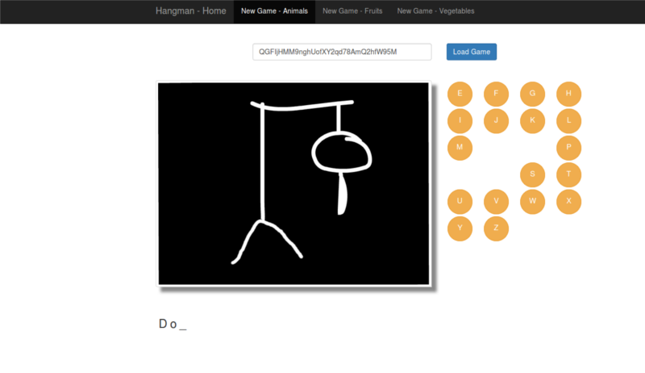

# Hangman Game

Implementation of popular guessing game in Java. Application is built as a web-app on top of [Spring Boot]
and [MapDB] embedded database engine.

Example screenshot:

### Requirements
 * JDK8
 * JAVA_HOME variable pointing to active java directory

### Running the App

* Gradle is installed:

  `$ gradle bootRun`

* Gradle is not installed, Unix OS:

`$ ./gradlew bootRun`

* Gradle is not installed, Windows OS:

  `gradlew.bat bootRun`

Then point your browser at [http://localhost:8080]

### Design objectives

Game is always in a certain state. Game state/snapshot is a minimum, immutable set of data that can be used to restore
game from and based on which result of the game can be generated together with any data needed for outer layers.
State of the game is immutable but as long as game is not finished every user action causes game to be moved to another state.
Major focus is laid on keeping state as a whole instead of recording every change.
In my case game state consists of secret, maximum number of incorrect user guess, and set of user guesses.
Every guess element contains only its value.
Any extra information like time the game was started, order of the guesses or time they were taken is irrelevant as it
has no effect on result of the game.

### implementation: ajax, jquery, bootstrap

### How to play

* Starting a new game

Click any of the top options
- New Game - Animals
- New Game - Fruits
- New Game - Vegetables

* Continuing started game
1. Paste game token into input
2. Click 'Load Game' button

### Project description
FIXME FIXME FIXME ------------------------- spirng mvc test framework- dodac czy nie

The project uses:
* [Spring Boot]
* [Spring Hateoas]
* [MapDB]
* [Gradle]
* [Thymeleaf]
* [jQuery]
* [Bootstrap]
* [Spring MVC Test Framework]
* [MultithreadedTC]
* [Mockito]

### Tested on:

- firefox
- chrome
- opera
- IE

### What’s Happening Under Hood

* GameController.java -
* hangman.js -

[Spring Boot]:http://projects.spring.io/spring-boot
[Spring Hateoas]:http://projects.spring.io/spring-hateoas
[MapDB]:http://www.mapdb.org
[Gradle]:https://gradle.org
[Thymeleaf]:http://www.thymeleaf.org
[jQuery]:http://jquery.com
[Bootstrap]:http://getbootstrap.com
[Spring MVC Test Framework]:https://github.com/spring-projects/spring-test-mvc
[MultithreadedTC]:http://www.cs.umd.edu/projects/PL/multithreadedtc
[Mockito]:http://mockito.org
[http://localhost:8080]:http://localhost:8080